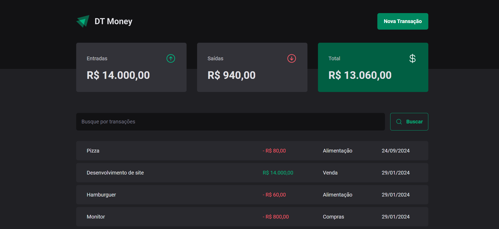

# DT Money - Gerenciador de Finanças

## Descrição

O DT Money é um aplicativo web completo para gerenciar suas finanças de forma eficiente. Ele permite registrar entradas e saídas de dinheiro, visualizar um histórico detalhado de todas as transações e apresentar um balanço geral atualizado.




## Tecnologias

* **React:** Biblioteca JavaScript para construção de interfaces de usuário.
* **styled-components:** Biblioteca CSS-in-JS para estilização dos componentes.
* **react-hook-form:** Biblioteca para criação de formulários.
* **@hookform/resolvers:** Extensão do react-hook-form que fornece resolvers para diferentes esquemas de validação, como Zod.
* **@radix-ui/react-dialog, @radix-ui/react-radio-group:** Componentes da Radix UI que oferecem elementos de interface do usuário acessíveis e personalizáveis, como diálogos e grupos de rádio.
* **axios:** Biblioteca para fazer requisições HTTP, utilizada para se comunicar com a API e buscar os dados das transações.
* **use-context-selector:** Hook personalizado que permite selecionar partes específicas do contexto, otimizando a renderização de componentes.
* **zod:** Biblioteca de validação de dados TypeScript, utilizada para garantir a integridade dos dados inseridos pelo usuário.
* **scheduler:** Biblioteca para agendar tarefas e otimizar a renderização, garantindo um desempenho suave da aplicação.


## Como executar o projeto

1. **Clone o repositório:**
  ```bash
  git clone https://github.com/faelperini/03-dt-money
  ```

2. **Instale as dependências:**
  ```bash
  cd 03-dt-money
  npm install
  ```

3. **Inicie o desenvolvimento:**
  ```bash
  npm run dev:server
  npm run dev
  ```

O aplicativo será iniciado em http://localhost:5173/

## Funcionalidades

* **Registro de Transações:** Adicione facilmente novas entradas e saídas, categorizando-as para melhor organização.

* **Histórico Detalhado:** Visualize um histórico completo de todas as suas transações, incluindo data, valor e categoria.

* **Balanço Geral:** Obtenha uma visão geral rápida de suas finanças, com informações sobre o total de entradas, saídas e saldo disponível.

## Conceitos Abordados

* **Componentes funcionais e hooks:** Utilização de componentes funcionais e hooks do React para criar uma arquitetura modular e reutilizável.
* **Gerenciamento de estado:** Utilização do contexto do React para gerenciar o estado global da aplicação, como os dados das transações.
* **Programação reativa:** Utilização de conceitos reativos para atualizar a interface do usuário de forma eficiente, sempre que os dados forem alterados.
* **Validação de dados:** Utilização do Zod para validar os dados de entrada, garantindo a integridade dos dados e evitando erros.
* **Estilização com styled-components:** Utilização do styled-components para criar estilos personalizados e temáticos de forma eficiente.
* **Acessibilidade:** Utilização de componentes da Radix UI que são projetados para serem acessíveis, garantindo que a aplicação possa ser utilizada por todos os usuários.
